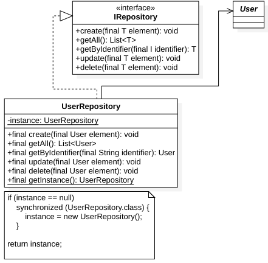

# Implementation of Singleton pattern.

## Definition
[Refactoring Guru](https://refactoring.guru/design-patterns/singleton): Singleton is a creational design pattern that lets you ensure that a class has only one instance, while providing a global access point to this instance.

## Context
The Repository pattern must provide data for the application through a source (local or remote).

However, in most cases, only one instance of a class that implements the repository interface is required. For this reason, we use the Singleton pattern, to restrict the number of instances.

## Class diagram
<figure>
  
</figure>

