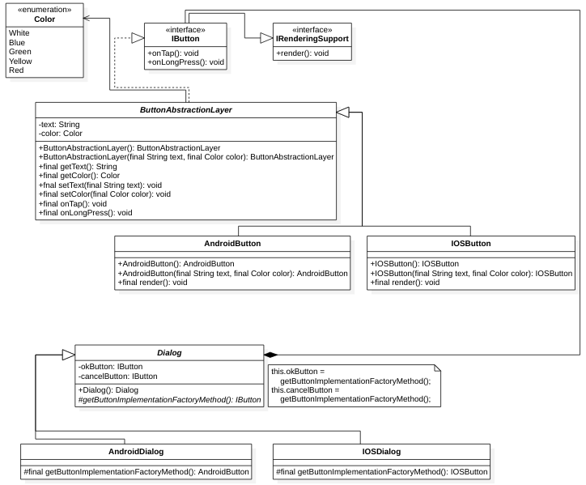

# Implementation of Factory Method pattern.

## Definition
[Refactoring Guru](https://refactoring.guru/design-patterns/factory-method): Factory Method is a creational design pattern that provides an interface for creating objects in a superclass, but allows subclasses to alter the type of objects that will be created.

## Context
A component can be rendered differently depending on the platform. However, it can contain the same attributes and behaviors.

In this case, we use the Factory Method pattern to render according to each platform, but maintaining the attributes and behaviors.

## Class diagram
<figure>
  
</figure>
